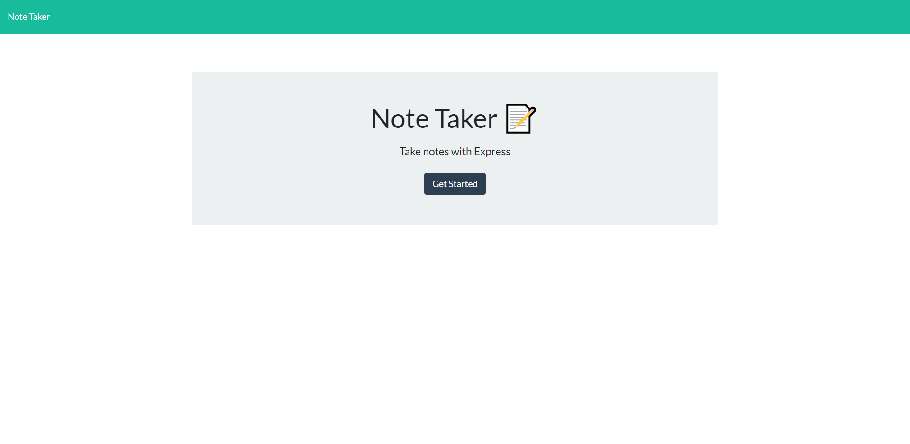
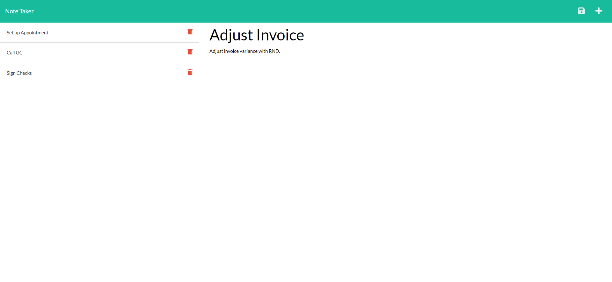

# The_Note_Taker 🚀

## Table of Contents
* [Description](#description)
* [Installation](#installation)
* [Link](#link)
* [Contribution](#contribution)
* [Contact](#contact-me)

# Description

Using Express.js this project can take and save notes for your busy work day. Using express.js this app will save and retrieve your data from a json file. The deployed application can be found using heroku, see link below!

# Installation

Prerequisites: [Node.js](https://nodejs.org/en/) &amp; [Express](https://www.npmjs.com/package/express)

* Clone code to your own local repo following the link below. 
* Using Command Line, head over to the root directory.
* run npm install -y
* run npm i express
* run npm start

**[Install Link](https://github.com/brian-nelson10/The-Note-Taker.git)**

# Link

Link to Deployed site:
**[Note Taker Link](https://protected-sands-00767.herokuapp.com/)**

**Screenshots!**

 

# Contribution

Currently seeking those who can provide eyeball time, brain juice, lines of code, code improvements, raising an issue, asking a question, run the communication outside of the code repo, or even stump up some coin! Please see contact for link!! 

# Contact Me 

Want to contribute?? Drop me a line **[here](mailto:bn3l10@gmail.com)**

Check out my **[GitHub](https://github.com/brian-nelson10)**

## Maker
Made with ❤️ by brian